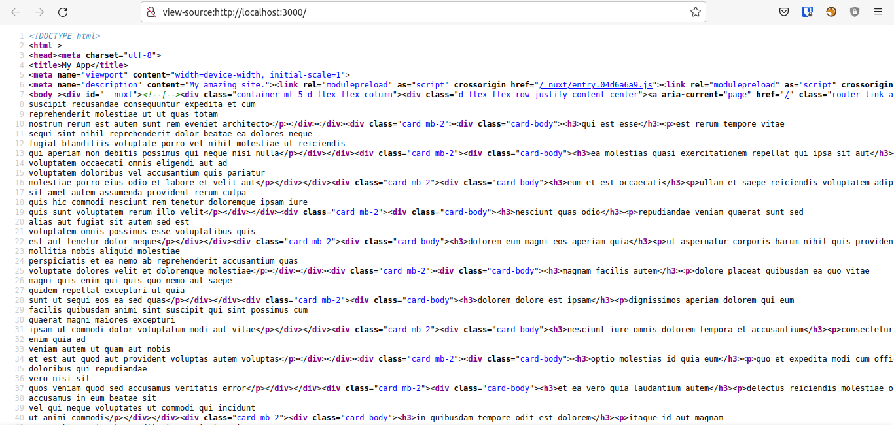
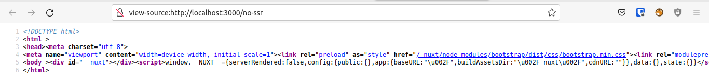

# Example Nuxt JS 3 - SSR and Non SSR

## How To Run
- clone and run `node .output/server/index.mjs`
- need internet online

See Different between page `ssr` and `non-ssr` in `view page source`

- `ssr`

- `non-ssr`

